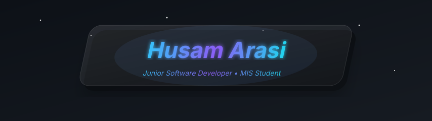

  

<h1 align="center">Hi there, I'm Husam Arasi 👋</h1>

  

---
## 👨‍💼 About Me

🎓 Fourth-year Management Information Systems (MIS) student in Aden University 

💡 Self-taught software developer passionate about building practical applications and continuously improving my skills.

🌱 Currently mastering:
- ⚡ C++
- 🏗️ Object-Oriented Programming (OOP)
- 🧠 Data Structures & Algorithms
- 🔍 Problem Solving

🚀 Expanding my expertise in:
- 🎨 C#
- 🖥️ .NET & Windows Forms
- 🗄️ SQL Server
- 🏛️ Software Development Principles

📚 Following the ProgrammingAdvices roadmap by **Dr. Mohammed Abu-Hadhoud**

🎯 Goal: Become a professional Software Engineer by building strong fundamentals and real-world projects.

🤖 Exploring AI tools to improve software development, productivity, and learning.

---

## 🧠 Skills & Tools

  
  
  
  
  
  

